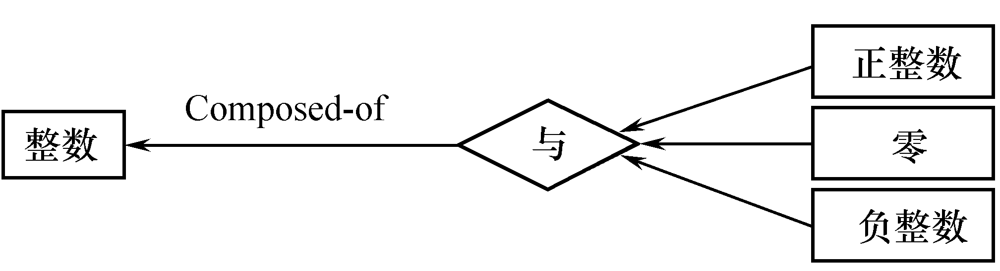
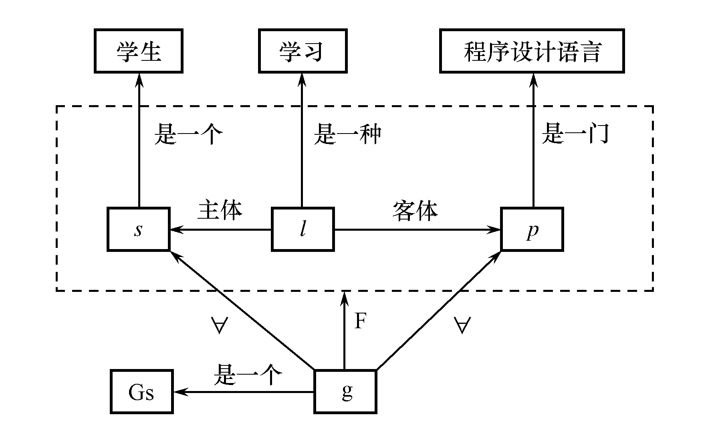

# 人工智能原理笔记

## 目录

[TOC]

## 知识表示

### 语义网络

####常见关系

1. 类属关系

   **一个主要的特征是属性的继承性** 

   * AKO:是一种,表示是另一个事物的一种类型
   * AMO:是一员,表示是某事物的一个成员
   * ISA:是一个 ,表示是另一个事物的实例

2. 包含关系

   **整体与部分的关系,部分往往不具备整体的属性**

   * Part-of:一部分

3. 占有关系

   * have表示事物或属性之间的具有关系

4. 时间关系

   * Before:在前
   * After:在后
   * During: 在...期间

5. 位置关系

   * Located-at:
   * Located-on:
   * Located-under:
   * Located-inside:
   * Located-outside:

6. 相近关系

   * Similar-to:相似
   * Near-to:相近

7. 推论关系

   * 推出

8. 因果关系

   * if-then

9. 组成关系

   * Composed-of

   

10. 属性关系

   * is :老张 *is* 40岁

#### 表示方法

1. 事实性知识表示

2. 情况和动作表示

   一只名叫‘神飞’的小燕子从三月到十一月占有一个巢

   

   **要点在于引入了一个情况节点:占有**

3. 与和或关系

   

4. 存在和全称量词

   任何学生都学了一种编程语言

   Gs表示具有全称量化的一般事件.s是全部学生,l是存在一个学习事件

   这张图表示每个学生都学习了一门程序设计语言

   

   

   表示：每个学生都学习了所有的程序设计课程

   
   
   

   

